# AI Job Candidate Reviewer

 **Stop spending hours manually screening resumes. Let AI do the first pass.**

Transform your hiring workflow with AI-powered resume screening that's fast, consistent, and adapts to your preferences.

## Why This Matters

Recruiting at scale is **painful**:
- **Time-consuming** - Hours spent reading similar resumes
- **Inconsistent** - Different standards across reviewers or days
- **Draining** - Mental fatigue from repetitive evaluation
- **Lost opportunities** - Best candidates buried under bulk-spam and low-quality applications

**This tool changes that:**

**Drop files, get rankings** - No complex setup, just organized folders  
**Consistent evaluations** - Same criteria applied to every candidate  
**Detailed insights** - Scores, strengths, concerns, and interview priorities  
**Gets smarter** - Learns from your feedback to match your preferences  
**Powered by GPT-5** - Latest AI models with automatic fallback

```
Drop Files → AI Analysis → Ranked Results → Your Feedback → Improved Rankings
```

## Key Features

- **Structured evaluations** with scores (0-100) and recommendations
- **Interview priorities** (HIGH/MEDIUM/LOW) to focus your time
- **Smart duplicate detection** - Automatically identifies duplicate/fake candidates by email, phone, LinkedIn, and GitHub
- **Screening filters** - Define hard rules that AI must enforce (auto-reject unqualified candidates)
- **AI learning** from your feedback improves future screenings
- **Evaluation history** - Track how candidate scores change over time with re-evaluations
- **Multiple formats** - CSV reports and HTML summaries
- **Privacy-first** - All data stays local, only candidate content goes to OpenAI
- **Fast** - Process multiple candidates in seconds

## 🚀 5-Minute Setup

**Prerequisites:** Python 3.9+, OpenAI API key ([get one here](https://platform.openai.com/api-keys))

```bash
# 1. Clone and install
git clone <repo-url>
cd ai_job_candidate_reviewer
pip3 install -r requirements.txt

# 2. Configure API key
echo "OPENAI_API_KEY=sk-proj-your-key-here" > .env

# 3. Verify it works
python3 candidate_reviewer.py test-connection
```

**That's it!** You're ready to start screening candidates.

---

## Table of Contents

**Getting Started:**
- [Quick Start Guide](#quick-start-guide) - Get up and running fast
- [How It Works](#how-it-works) - Visual workflow diagram
- [Environment Configuration](#environment-configuration) - API keys and data paths

**Using the Tool:**
- [File Organization](#file-organization) - How files are structured
- [All Commands](#all-commands) - Complete command reference
- [Results & Reports](#results--reports) - Understanding the output

**Going Further:**
- [Advanced Features](#advanced-improve-results) - Fine-tune AI behavior
- [Screening Filters](#screening-filters) - Automated policy enforcement for hard requirements
- [Smart Duplicate Detection](#smart-duplicate-detection) - Automatic duplicate/fake candidate detection
- [AI Learning & Re-evaluation](#ai-learning--re-evaluation) - How the system improves over time
- [Troubleshooting](#troubleshooting) - Common issues
- [Additional Resources](#additional-resources) - Detailed guides

---

## Quick Start Guide

### Step 1: Setup a Job (once per position)

```bash
# Create the data directory
mkdir -p data/intake

# Drop these files into data/intake/:
# - job_description.pdf (required)
# - ideal_candidate.txt (optional - helps AI understand what you want)
# - warning_flags.txt (optional - red flags to watch for)

# Process the job
python3 candidate_reviewer.py setup-job "senior_engineer"
```

### Step 2: Process Candidates (ongoing)

```bash
# Drop candidate files into data/intake/:
# Flexible naming - prefix OR suffix style both work:
# - resume_john_doe.pdf  OR  john_doe_resume.pdf
# - coverletter_john_doe.pdf  OR  john_doe_coverletter.pdf (optional)
# - application_john_doe.txt  OR  john_doe_application.txt (optional)

# Process them
python3 candidate_reviewer.py process-candidates "senior_engineer"
```

### Step 3: Review Rankings

```bash
# See ranked candidates in terminal
python3 candidate_reviewer.py show-candidates "senior_engineer"

# Or open detailed HTML report in browser
python3 candidate_reviewer.py open-reports "senior_engineer"
```

### Step 4: Teach the AI (optional but powerful)

```bash
# Give feedback on evaluations (interactive)
python3 candidate_reviewer.py provide-feedback 1 "John Doe"

# You can prefill notes by pasting as a third argument; you'll still be prompted
python3 candidate_reviewer.py provide-feedback 1 "John Doe" \
  "Too much weight on years of experience, not enough on practical skills"

# When rejecting candidates, you can create screening filters (hard rules)
# that automatically reject similar candidates in the future

# Re-evaluate with improved AI (shows score deltas)
python3 candidate_reviewer.py re-evaluate 1
# Output: ✅ Re-evaluated John Doe (was 60 → now 75 | Δ +15)
```

**💡 Pro Tips:** 
- The AI learns from your feedback and applies those insights to future evaluations
- Create screening filters to automatically enforce hard requirements (e.g., "must have 5+ years Python")
- Re-evaluations show score changes and skip rejected candidates by default

---

## How It Works

### Visual Workflow

```mermaid
flowchart TD
    Start([👤 You Drop Files]) --> Setup{First Time?}
    
    Setup -->|Yes| Job[📄 Setup Job<br/>job_description.pdf<br/>ideal_candidate.txt<br/>warning_flags.txt]
    Setup -->|No| Candidates
    
    Job --> Store1[(💾 Job Context<br/>Stored)]
    Store1 --> Candidates
    
    Candidates[📋 Add Candidates<br/>resume_john_doe.pdf<br/>coverletter_john_doe.pdf] --> AI[🤖 AI Analysis<br/>GPT-5/GPT-4]
    
    AI --> Eval[📊 Generate Evaluation<br/>• Score 0-100<br/>• Strengths/Concerns<br/>• Recommendation<br/>• Interview Priority]
    
    Eval --> Output[📁 Create Reports<br/>• CSV Spreadsheet<br/>• HTML Dashboard<br/>• JSON Details]
    
    Output --> Review{👤 You Review}
    
    Review -->|Happy| Done([✅ Hire/Reject])
    Review -->|Needs Tuning| Feedback[💬 Provide Feedback<br/>'Too focused on years<br/>not enough on skills']
    
    Feedback --> Learn[(🧠 AI Learns<br/>Insights Stored)]
    Learn --> ReEval[🔄 Re-evaluate<br/>with Insights]
    ReEval --> AI
    
    style Start fill:#e1f5ff
    style AI fill:#fff4e1
    style Learn fill:#f0e1ff
    style Done fill:#e1ffe1
    style Output fill:#ffe1f5
```



### Simple Explanation

1. **Drop Files** → You organize files by name (no complex paths)
2. **AI Analyzes** → GPT-5 reads and evaluates each candidate
3. **Get Rankings** → Receive scores, recommendations, priorities
4. **Teach AI** → Give feedback, AI adapts to your preferences
5. **Improve** → Re-evaluate with smarter AI

**Key Benefits:**
- **Fast** - Process 10 candidates in seconds
- **Consistent** - Same criteria for everyone
- **Smart** - Learns your preferences over time
- **Structured** - Clear scores and priorities

---

## ⚠️ Important Notes

- **AI assists, humans decide** - Always review AI evaluations before hiring decisions
- **Privacy** - Candidate data is sent to OpenAI for analysis per their [privacy policy](https://openai.com/policies/row-privacy-policy/)
- **Continuous improvement** - The system gets better with your feedback
- **Model visibility** - Every command shows which AI model is being used


---

## Environment Configuration

### Required: OpenAI API Key

Create a `.env` file in the project root with your OpenAI API key:

```bash
OPENAI_API_KEY=sk-proj-your-api-key-here
```

Get your API key from: https://platform.openai.com/api-keys

### Optional: Data Storage Path

By default, all data is stored in `./data/`. You can customize this with environment variables:

```bash
# Change base data directory (useful for testing or custom storage)
BASE_DATA_PATH=./custom_data

# Or override individual paths
INTAKE_PATH=./my_intake
JOBS_PATH=./my_jobs
CANDIDATES_PATH=./my_candidates
OUTPUT_PATH=./my_output
```

**Directory Structure:**

The application automatically creates these subdirectories if they don't exist:

```
{BASE_DATA_PATH}/          # Default: ./data
├── intake/                # Drop files here for processing
├── jobs/                  # Processed job descriptions (auto-created)
├── candidates/            # Processed candidate files (auto-created)
└── output/                # Generated reports (auto-created)
```

**You only need to create the base directory** (e.g., `mkdir data` or `mkdir custom_data`). The subdirectories are created automatically when you run commands.

**Common use cases:**
- **Testing:** `BASE_DATA_PATH=./test_data` (keeps test data separate)
- **Production:** `BASE_DATA_PATH=/var/app/data` (system-wide storage)
- **Development:** `BASE_DATA_PATH=./data_dev` (separate dev environment)

**Note:** These are optional. For normal use, just set `OPENAI_API_KEY` and use the default `./data/` directory.

For more configuration options, see `CONFIGURATION.md`.

---

## File Organization

**1. Drop files here:**

Example for `setup-job` 
```
data/intake/
├── job_description.pdf              # Required for setup-job
├── ideal_candidate.txt              # Optional for setup-job  
├── warning_flags.txt                # Optional for setup-job

```
Example for `process-candidates`
```
data/intake/
├── resume_john_doe.pdf              # Required for process-candidates
├── coverletter_john_doe.pdf         # Optional for process-candidates
└── application_john_doe.txt         # Optional for process-candidates
...
├── resume_jane_doe.pdf              # Required for process-candidates
└── application_jane_doe.txt         # Optional for process-candidates
...
```


**2. After processing, files are organized into:**
```
data/
├── jobs/                           # Processed job info
│   └── {job_name}/
│       ├── job_description.pdf
│       ├── ideal_candidate.txt
│       └── warning_flags.txt
├── candidates/                     # Processed candidates  
│   └── {job_name}/
│       ├── john_doe/
│       │   ├── resume.pdf
│       │   ├── cover_letter.pdf
│       │   └── review.json
│       └── jane_smith/
│           ├── resume.pdf
│           └── application.txt
└── output/                        # Results
    └── {job_name}/
        ├── candidate_scores.csv    # 👈 Main review file
        ├── summary_report.html
        └── detailed_reviews/
```

Notes:
- Job setup files are moved from `data/intake/` into `data/jobs/{job_name}/` during setup, keeping intake clean.
- Candidate files are copied into their candidate directories and the originals in intake are cleaned up after successful processing.
- If a candidate is missing required files, processing stops at that candidate with a clear error so you can fix/remove and retry.

---

## All Commands

### **Core Workflow:**
```bash
python3 candidate_reviewer.py setup-job "job_name"           # Setup job from intake files
python3 candidate_reviewer.py process-candidates "job_name"  # Process candidates from intake
python3 candidate_reviewer.py show-candidates "job_name"     # Show ranked results
```

Options:
- setup-job
  - `-j, --job-description PATH`  Use a specific job description file
  - `-i, --ideal-candidate PATH`  Use a specific ideal-candidate file (optional)
  - `-w, --warning-flags PATH`    Use a specific warning-flags file (optional)
  - `--update/--no-update`        Update an existing job setup (default: no-update)

- process-candidates
  - `-r, --resume PATH`           Process a single candidate by file path
  - `-c, --cover-letter PATH`     Optional cover letter path
  - `-a, --application PATH`      Optional application/questionnaire path
  - `-n, --candidate-name TEXT`   Candidate name (required with -r)
  - `-v, --verbose`               Show detailed AI prompt and response

- show-candidates: no options

### **Feedback & Learning:**
```bash
python3 candidate_reviewer.py provide-feedback "job_or_number" "candidate_or_number" ["feedback text"]
python3 candidate_reviewer.py show-insights "job_or_number"     # View AI learning
python3 candidate_reviewer.py re-evaluate "job_or_number"       # Re-evaluate with insights
```

Candidate resolution:
- Accepts numeric index (as shown by show-candidates), exact directory name, or human-readable name with spaces/accents.
- For non-exact matches, the CLI asks for confirmation before applying.
- show-insights: no options
- re-evaluate
  - `-c, --candidates TEXT`   Specify one or more candidates (repeatable)
  - By default, skips rejected candidates (use `-c` to re-evaluate specific rejected candidates)
  - Shows score deltas (e.g., "was 60 → now 75 | Δ +15")

### **Reports & Analysis:**
```bash
python3 candidate_reviewer.py open-reports "job_name"        # Open HTML report in browser
python3 candidate_reviewer.py list-reports "job_name"        # List all available reports
```

Options:
- open-reports: no options
- list-reports: no options

### **System Management:**
```bash
python3 candidate_reviewer.py test-connection                # Test API connection
python3 candidate_reviewer.py list-models                    # Show available AI models
python3 candidate_reviewer.py list-jobs                      # Show all jobs
python3 candidate_reviewer.py --help                         # Show all commands
```

Options:
- test-connection: no options
- list-models: no options
- list-jobs: no options

---

## Results & Reports

**CSV Format:** Open `candidate_scores.csv` in Excel with:
- **Overall Score** (0-100)
- **Recommendation** (STRONG_YES, YES, MAYBE, NO, STRONG_NO)
- **Key Strengths** and **Concerns**
- **Interview Priority** (HIGH, MEDIUM, LOW)

**Terminal Ranking:** Use `--show_candidates` for quick command-line view:
```
Job: senior_python_dev_2024

1. john_doe - STRONG_YES (Score: 87)
   ✅ Expert Python dev, 6yrs experience, strong portfolio
   
2. mike_smith - YES (Score: 72) 
   ✅ Good technical skills, solid experience
   ⚠️ Limited leadership experience

3. jane_wilson - MAYBE (Score: 58)
   ✅ Strong communication, eager to learn  
   ⚠️ No Python experience, career change

4. bob_jones - NO (Score: 34)
   ❌ No relevant experience, poor communication
```

**This shows users both output options:**
- **CSV** for detailed spreadsheet analysis
- **Terminal ranking** for quick command-line review

---

## File Naming

**Job files:** Any names work, script auto-detects
**Candidate files:** Include name in filename
- `resume_john_doe.pdf` → Candidate: "john_doe"
- `JohnDoe_CV.pdf` → Candidate: "johndoe"

---

## Advanced: Improve Results

Create a file that explains the ideal candidate: `ideal_candidate.txt`:
```
• 5+ years Python experience
• Strong communication skills
• AWS/cloud experience preferred
• Team leadership or mentoring experience
• Bachelor's degree in Computer Science or equivalent

Questionnaire responses should show:
• Specific examples with measurable results
• Clear problem-solving thought process
• Enthusiasm for the role and company
• Understanding of our tech stack
• Realistic timeline estimates for projects
```

Create `warning_flags.txt`:
```
• Job hopping (6+ jobs in 2 years)
• No relevant programming experience
• Poor written communication

Questionnaire red flags:
• Vague answers without specific examples
• Copy-pasted responses from other applications
• Unrealistic claims or timelines
• Negative attitude toward previous employers
• Avoiding technical questions
• Hostile answers on application questionnaire
• Using N/A, - and other no-answers for the application questionnaire


```

This way the AI can evaluate both the resume/cover letter AND the questionnaire responses using your specific criteria. It helps catch candidates who look good on paper but give poor application answers, or vice versa.

---

## Screening Filters

**Automated Policy Enforcement for Hard Requirements**

Screening filters allow you to define rules that the AI **must** enforce, ensuring consistent rejection or downgrading of unqualified candidates.

### Quick Example

When you reject a candidate during feedback, you can create a filter:

```bash
python3 candidate_reviewer.py provide-feedback "job_name" "candidate_name"
# Mark as NO or STRONG_NO
# System prompts: "Create a screening filter from this rejection? (y/n)"
```

You'll define:
- **Title**: "Require ≥3 years people management"
- **Condition**: "When candidate has less than 3 years verified people management experience"
- **Action**: `set_recommendation=NO` or `cap_recommendation=MAYBE`

### What Filters Can Do

| Action | Effect | Use Case |
|--------|--------|----------|
| `set_recommendation=NO` | Force rejection | Deal-breakers (e.g., missing required certification) |
| `cap_recommendation=MAYBE` | Limit to at most MAYBE | Concerns but not disqualifying |
| `deduct_points=20` | Subtract from score | Penalize without auto-rejection |

### Common Filter Examples

**Minimum experience requirement:**
```json
{
  "id": "require-5-years-python",
  "title": "Require 5+ years Python experience",
  "when": "When candidate has less than 5 years of Python development experience",
  "action": {
    "set_recommendation": "NO",
    "deduct_points": 40
  },
  "enabled": true
}
```

**Red flag for job hopping:**
```json
{
  "id": "flag-job-hopping",
  "title": "Flag excessive job hopping",
  "when": "When candidate has 4+ jobs in the last 2 years",
  "action": {
    "cap_recommendation": "MAYBE",
    "deduct_points": 15
  },
  "enabled": true
}
```

### How It Works

1. **AI evaluates** candidate against filter conditions
2. **AI marks** failed filters in evaluation notes
3. **Policy layer** deterministically enforces penalties (double-checks AI work)
4. **Reports show** which filters were triggered and why

### Managing Filters

View filters for a job:
```bash
cat data/jobs/{job_name}/screening_filters.json
```

Disable without deleting (edit file):
```json
{
  "id": "some-filter",
  "enabled": false,  // ← Temporarily disable
  ...
}
```

Re-evaluate after changing filters:
```bash
python3 candidate_reviewer.py re-evaluate "job_name"
```

**📖 See `SCREENING_FILTERS.md` for complete guide including examples, best practices, and troubleshooting.**

---

## AI Learning & Re-evaluation

### How the System Learns

The system improves through a feedback loop:

1. **Provide Feedback** → Tell the AI what it got wrong
2. **Generate Insights** → After every 2 feedback records, AI analyzes patterns
3. **Re-evaluate** → Apply insights to improve all candidate evaluations

### Feedback Collection

```bash
python3 candidate_reviewer.py provide-feedback "job_name" "candidate_name"
```

You'll be prompted to:
- Rate the candidate yourself (STRONG_YES to STRONG_NO)
- Give your score (0-100)
- Explain what the AI got wrong or missed
- Optionally create a screening filter (if rejecting)

### Insights Generation

After every 2 feedback records, the system:
- Analyzes patterns in your feedback
- Identifies what the AI is over/under-weighting
- Generates insights stored in `data/jobs/{job_name}/insights.json`

View insights:
```bash
python3 candidate_reviewer.py show-insights "job_name"
```

### Re-evaluation Process

```bash
# Re-evaluate all candidates (skips rejected by default)
python3 candidate_reviewer.py re-evaluate "job_name"

# Re-evaluate specific candidates (including rejected ones)
python3 candidate_reviewer.py re-evaluate "job_name" -c "John Doe" -c "Jane Smith"
```

**What happens during re-evaluation:**
- Loads updated insights and screening filters
- Re-evaluates candidates with improved AI understanding
- Shows score changes: `✅ Re-evaluated John Doe (was 60 → now 75 | Δ +15)`
- Maintains history in `evaluation_history.json` per candidate
- Regenerates CSV and HTML reports

**Smart defaults:**
- Processes highest-scoring candidates first (to focus on top talent)
- Skips rejected candidates unless explicitly specified
- Cleans up stale duplicate warnings
- Shows progress with counters (e.g., "2/10")

### Evaluation History

Every re-evaluation preserves the previous evaluation in `data/candidates/{job_name}/{candidate_name}/evaluation_history.json`.

This lets you:
- Track how scores changed over time
- See how insights improved evaluations
- Audit AI decision-making
- Rollback if needed (manually)

**Example history:**
```json
[
  {
    "overall_score": 65,
    "recommendation": "MAYBE",
    "timestamp": "2024-10-13T14:30:00"
  },
  {
    "overall_score": 78,
    "recommendation": "YES",
    "timestamp": "2024-10-13T16:45:00"
  }
]
```

### Filters vs Insights

| Feature | Type | Use Case |
|---------|------|----------|
| **Screening Filters** | Hard rules | Deal-breakers, minimum requirements, compliance |
| **Insights** | Soft guidance | Preferences, nuanced evaluation criteria |

Both work together:
- **Filters** automatically reject/downgrade unqualified candidates
- **Insights** help AI better evaluate qualified candidates

---

## Smart Duplicate Detection

The system automatically detects and handles duplicate candidates using identity-based matching. This protects you from:
- **Duplicate submissions** - Same person submitting multiple times
- **Fake candidates** - Different names but same contact information
- **Name collisions** - Different people with the same name

### How It Works

When processing candidates, the system extracts and compares:
- **Email addresses** (e.g., `john.doe@example.com`)
- **Phone numbers** (e.g., `555-123-4567`)
- **LinkedIn profiles** (e.g., `linkedin.com/in/johndoe`)
- **GitHub profiles** (e.g., `github.com/johndoe`)

### Duplicate Scenarios

**1. Same name + matching identifiers:**
```
✅ Legitimate duplicate - files merged into existing candidate
🔁 Merging duplicate files for 'john_doe' (matching identifiers found)
```

**2. Different names + matching identifiers:**
```
⚠️  Potential fake detected - processed separately and clearly flagged
⚠️  DUPLICATE IDENTIFIERS: 'jane_smith' shares identifiers with 'john_doe'
   Action: Created 'jane_smith__DUPLICATE_CHECK' with warning file
   Overlapping identifiers: emails: john@example.com; phones: 5551234567
```

**3. Same name + different identifiers:**
```
⚠️  Different people with same name - separate directories created
⚠️  NAME COLLISION: Found existing 'john_doe' with different identifiers
   New candidate directory: john_doe__2
```

### What Gets Saved

Each candidate gets a `candidate_meta.json` file storing their identifiers for future duplicate checks. If different names share identifiers, the second profile is created as `{name}__DUPLICATE_CHECK[_N]` and both profiles get a `DUPLICATE_WARNING.txt` file with overlap details. This is automatic—no action needed during intake.

### Privacy Note

Identifiers are extracted from resume/cover letter/application text you provide and stored locally. They're never sent to OpenAI separately—only as part of the full candidate documents during evaluation.

### How Flags Appear in Reports

- Terminal ranking: Candidates are tagged with "🚨 DUPLICATE" and a short reason line is printed.
- CSV output: A new "Flags" column includes "DUPLICATE_IDENTIFIERS" when applicable.
- HTML report: Candidate headers append "🚨 DUPLICATE" and a red banner summarizes the issue.

---

## Troubleshooting

**Common Issues:**

| Problem | Solution |
|---------|----------|
| ❌ Missing API key | Add `OPENAI_API_KEY` to `.env` file ([get key](https://platform.openai.com/api-keys)) |
| ❌ No job description | Drop a job description PDF into `data/intake/` |
| ❌ No candidates found | Ensure resume filenames include candidate names (e.g., `resume_john_doe.pdf`) |
| ❌ File size errors | Check `MAX_FILE_SIZE_MB` setting (default: 2MB) |
| ❌ Wrong data directory | Verify `BASE_DATA_PATH` environment variable |

**Still stuck?** Check the [Additional Resources](#-additional-resources) section below for detailed guides.

---

## Additional Resources

### For Users

- **[Getting Started Guide](GETTING_STARTED.md)** - Detailed step-by-step setup and usage tutorials
- **[Screening Filters Guide](SCREENING_FILTERS.md)** - Complete guide to automated policy enforcement
- **[Configuration Guide](CONFIGURATION.md)** - Complete reference for all environment variables and settings
- **[GitHub Issues](../../issues)** - Report bugs or request features

### For Developers & Contributors

- **[Development Guide](DEVELOPMENT.md)** - Local setup, testing, and contribution workflow
- **[Architecture Overview](ARCHITECTURE.md)** - System design, components, and data flow
- **[GitHub Actions Setup](GITHUB_ACTIONS_SETUP.md)** - CI/CD pipeline configuration

**Quick Dev Commands:**
```bash
./pre-push.sh              # Run all checks before pushing
python3 -m pytest tests/   # Run all tests
python3 -m black .         # Format code
python3 -m isort .         # Sort imports
```

---

## Contributing

Found a bug? Have an idea? Contributions are welcome!

1. Check existing issues or create a new one
2. Fork the repository
3. Make your changes
4. Run `./pre-push.sh` to validate
5. Submit a pull request

See `DEVELOPMENT.md` for development setup and guidelines.

---

## License

MIT License - See [LICENSE](LICENSE) file for details.

This software is provided "as-is" for evaluation and screening assistance. The AI-generated evaluations should be reviewed by humans before making hiring decisions.

---

## Acknowledgments

Built with:
- OpenAI GPT-5 / GPT-4
- Python 3.9+
- Click, pypdf

---

**Ready to transform your hiring process?** [Get started now](#5-minute-setup)
