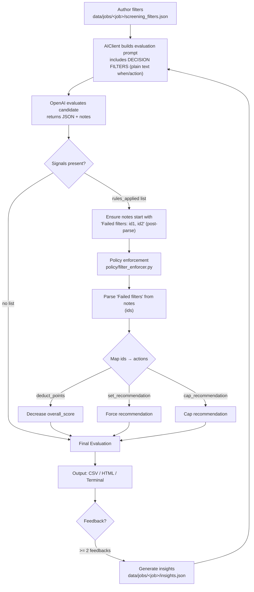

# Screening Filters Guide

**Automated Policy Enforcement for Candidate Screening**

## Overview

Screening filters allow you to define hard rules that the AI **must** enforce during candidate evaluation. This ensures consistent application of your hiring criteria across all candidates, regardless of AI model variability.

### Why Use Screening Filters?

- **Consistency** - Automatically reject/downgrade candidates who don't meet minimum requirements
- **Efficiency** - Save time by automatically filtering out unqualified candidates
- **Compliance** - Ensure legal/policy requirements are always enforced
- **Transparency** - Clear, documented rules that explain why candidates were rejected

## How It Works

### TL;DR (visual)



Key points:
- Filters are human-authored plain text; the AI detects violations from them.
- Actual penalties and recommendation changes are applied deterministically after AI.
- “Failed filters: …” at the top of `detailed_notes` is the enforcement trigger.

### Two-Layer Architecture

The system uses a hybrid approach for maximum reliability:

1. **AI Layer** - GPT evaluates the candidate and checks filter conditions
2. **Policy Layer** - `filter_enforcer.py` deterministically enforces penalties post-evaluation

This dual-layer approach ensures that even if the AI makes a mistake, the policy layer will catch it and enforce the correct penalties.

### Filter Actions

Each filter can specify one or more actions:

| Action | Effect | Use Case |
|--------|--------|----------|
| `set_recommendation` | Force recommendation to specific value (e.g., NO) | Hard rejections for deal-breakers |
| `cap_recommendation` | Limit maximum recommendation (e.g., MAYBE) | Candidates with concerns but not disqualified |
| `deduct_points` | Subtract points from score | Penalize but don't automatically reject |

## Creating Filters

### Method 1: Interactive Creation (Recommended)

When providing feedback on a candidate you're rejecting:

```bash
python3 candidate_reviewer.py provide-feedback "job_name" "candidate_name"
```

If you mark a candidate as NO or STRONG_NO, you'll be prompted:

```
📝 Would you like to create a screening filter from this rejection? (y/n)
```

The system will guide you through:
1. **Title** - Short description (e.g., "Require ≥3 years people management")
2. **Condition** - When to apply (prefilled with your feedback, but editable)
3. **Action** - Choose rejection type:
   - `set_recommendation=NO` - Hard rejection
   - `cap_recommendation=MAYBE` - Allow at most MAYBE

### Method 2: Manual Creation

Create or edit `data/jobs/{job_name}/screening_filters.json`:

Example:
```json
{
  "version": 1,
  "updated_at": "2025-10-13T21:42:39.336677",
  "filters": [
    {
      "id": "require-3-years-verified-people-management",
      "title": "Require ≥3 years verified people-management",
      "when": "When resume lacks ≥3 years of verified people management (hiring, reviews, coaching). Verify this from the resume as the source of truth. Do NOT count Lead/Tech Lead without responsibilities evidenced.",
      "action": {
        "set_recommendation": "NO",
        "deduct_points": 30
      },
      "enabled": true,
      "source": "human",
      "rationale": "Position requires at least 3 years of manager experience"
    }
  ]
}
```

## Filter Schema

### Required Fields

- `id` (string) - Unique identifier (auto-generated from title if created interactively)
- `title` (string) - Short description of the filter
- `when` (string) - Condition description for the AI to evaluate
- `action` (object) - One or more of:
  - `set_recommendation`: "STRONG_NO" | "NO" | "MAYBE" | "YES" | "STRONG_YES"
  - `cap_recommendation`: "STRONG_NO" | "NO" | "MAYBE" | "YES" | "STRONG_YES"
  - `deduct_points`: integer (0-100)
- `enabled` (boolean) - Whether the filter is active

### Optional Fields

- `source` (string) - Who created it (e.g., "human", "system")
- `rationale` (string) - Why this filter exists
- `updated_at` (ISO datetime) - Last modification time

## Common Filter Examples

### Hard Requirements

**Minimum years of experience:**
```json
{
  "id": "require-5-years-python",
  "title": "Require 5+ years Python experience",
  "when": "When candidate has less than 5 years of Python development experience",
  "action": {
    "set_recommendation": "NO",
    "deduct_points": 40
  },
  "enabled": true
}
```

**Required skills:**
```json
{
  "id": "require-aws-experience",
  "title": "Require AWS cloud experience",
  "when": "When candidate has no AWS or cloud computing experience",
  "action": {
    "cap_recommendation": "MAYBE",
    "deduct_points": 20
  },
  "enabled": true
}
```

### Red Flags

**Job hopping:**
```json
{
  "id": "flag-job-hopping",
  "title": "Flag excessive job hopping",
  "when": "When candidate has 4+ jobs in the last 2 years",
  "action": {
    "cap_recommendation": "MAYBE",
    "deduct_points": 10
  },
  "enabled": true
}
```

**Poor communication:**
```json
{
  "id": "flag-poor-communication",
  "title": "Flag poor written communication",
  "when": "When resume/cover letter has multiple spelling/grammar errors or is poorly structured",
  "action": {
    "deduct_points": 10
  },
  "enabled": true
}
```

### Compliance Requirements

**Work authorization:**
```json
{
  "id": "require-us-work-authorization",
  "title": "Require US work authorization",
  "when": "When candidate indicates they need visa sponsorship and we cannot sponsor",
  "action": {
    "set_recommendation": "NO"
  },
  "enabled": true
}
```

## How Filters Are Applied

### During Evaluation

1. **AI reads filters** from `screening_filters.json`
2. **AI evaluates candidate** against each filter condition
3. **If filter matches**, AI:
   - Marks it in `detailed_notes` as "Failed filters: filter-id-1, filter-id-2"
   - Applies penalties to score and recommendation
   - Includes `rules_applied` field in JSON response

### Post-Evaluation (Policy Layer)

4. **Policy enforcer** (`filter_enforcer.py`) runs after AI evaluation:
   - Parses "Failed filters: ..." from detailed_notes
   - **Deterministically applies** penalties (in case AI made mistakes)
   - Ensures score deductions are exact
   - Ensures recommendations are capped/set correctly

### In Reports

Filtered candidates appear in reports with clear indicators:

**Terminal output:**
```
5. candidate_name - NO (Score: 45)
   ⚠️ Failed filter: require-3-years-verified-people-management
   ✅ Strong technical skills
   ❌ Only 1 year people management experience
```

**CSV output:**
- Score reflects deductions
- Recommendation reflects cap/set actions
- Detailed notes include "Failed filters: ..." at the top

**HTML report:**
- Red banner for filtered candidates
- Clear explanation of which filters were triggered

## Managing Filters

### View Active Filters

```bash
# View all filters for a job
cat data/jobs/{job_name}/screening_filters.json
```

### Disable a Filter

Edit `screening_filters.json` and set `enabled: false`:

```json
{
  "id": "some-filter",
  "enabled": false,  // ← Disable without deleting
  ...
}
```

### Remove a Filter

Edit `screening_filters.json` and delete the filter object entirely, or set `enabled: false` to keep it for reference.

### Re-evaluate After Changing Filters

After adding/removing/modifying filters, re-evaluate candidates to apply the new rules:

```bash
python3 candidate_reviewer.py re-evaluate "job_name"
```

This will:
- Re-evaluate all non-rejected candidates
- Apply updated filters
- Show score deltas (e.g., "was 75 → now 60 | Δ -15")
- Generate new reports

## Best Practices

### Writing Clear Conditions

**❌ Vague:**
```
"when": "When candidate is not qualified"
```

**✅ Specific:**
```
"when": "When candidate has less than 3 years of Python experience OR no experience with Django/Flask frameworks"
```

### Combining Actions

For serious issues, combine multiple actions:

```json
{
  "action": {
    "set_recommendation": "NO",
    "deduct_points": 50
  }
}
```

For minor concerns:
```json
{
  "action": {
    "deduct_points": 10
  }
}
```

### Testing Filters

1. Create filter with `enabled: false`
2. Test on a few candidates manually
3. Enable filter and re-evaluate all candidates
4. Review results to ensure filter works as expected

### Documentation

Always include `rationale` to explain why the filter exists:

```json
{
  "rationale": "Past hires without management experience struggled in this role. Minimum 3 years required per hiring plan."
}
```

## Troubleshooting

### Filter Not Being Applied

**Check:**
1. `enabled: true` in the filter definition
2. Filter ID is unique and doesn't conflict with others
3. `when` condition is clear and specific enough for AI to understand
4. Re-evaluated candidates after adding filter

**Debug:**
```bash
# Re-evaluate with verbose output
python3 candidate_reviewer.py re-evaluate "job_name"
```

### Filter Too Aggressive

**Symptom:** All candidates are being rejected

**Fix:**
1. Review filter condition - might be too broad
2. Consider using `cap_recommendation` instead of `set_recommendation`
3. Reduce `deduct_points` value
4. Add more specific conditions to the `when` clause

### Filter Not Specific Enough

**Symptom:** Some candidates who should fail the filter are passing

**Fix:**
1. Make the `when` condition more specific
2. Provide examples in the condition (e.g., "Do NOT count Lead/Tech Lead without management responsibilities")
3. Reference specific resume sections (e.g., "Verify from Experience section in resume")

## Advanced: Multiple Actions

You can specify multiple actions that work together:

```json
{
  "id": "senior-role-requirements",
  "title": "Senior role minimum requirements",
  "when": "When candidate has less than 8 years experience OR lacks architecture/design leadership",
  "action": {
    "cap_recommendation": "MAYBE",
    "deduct_points": 25
  },
  "enabled": true
}
```

**Processing order:**
1. Points are deducted first
2. Then `set_recommendation` is applied (if present)
3. Then `cap_recommendation` is applied (if present)

## Integration with Feedback System

Filters work seamlessly with the feedback and learning system:

1. **Reject candidate** → Create filter
2. **Filter is applied** to future candidates automatically
3. **AI learns** from feedback (insights generation)
4. **Re-evaluate** applies both filters and insights

**Filters vs Insights:**
- **Filters**: Hard rules, deterministic enforcement
- **Insights**: Soft guidance, AI interpretation

Use filters for must-have requirements, insights for nuanced preferences.

## See Also

- `README.md` - Main documentation
- `ARCHITECTURE.md` - Technical architecture including filter enforcement
- `CONFIGURATION.md` - Configuration options
- `policy/filter_enforcer.py` - Policy layer implementation

